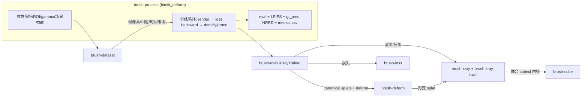
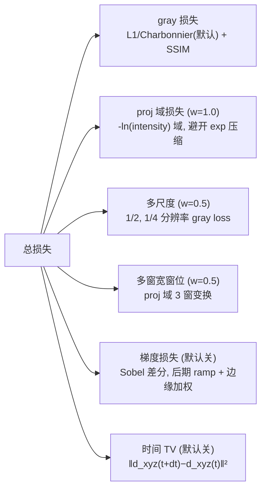

# Brush X-ray 动态重建 (deform 3D Gaussian Splatting)

用 4D 高斯泼溅 + HexPlane 形变场，从多角度 C-arm 心脏 DSA 序列（单帧投影）
重建可形变的 3D 心脏/血管结构。渲染采用 X-ray 圆锥束 Beer-Lambert 模型
（`intensity = exp(-∫μ ds)`），形变场由心脏相位 + 时间条件化。

数据：`RXA_pig_with_phase.dcm`（真实）/ `rotate_dsa_raw.dcm`（合成）。

---

## 1. 整体模块架构



| crate | 职责 |
|---|---|
| `brush-process` | CLI（fit_deform / fit_static / fit_centerline），实验驱动 |
| `brush-train` | 训练器：相位/时间条件形变、密度控制（densify/prune/split）、损失组合、eval |
| `brush-deform` | 形变网络：`HexPlane`（默认，融合内核 ~10x）与 `HashGrid` 后端 |
| `brush-render` / `brush-xray` | 正/反向 X-ray 圆锥束光栅化（Beer-Lambert） |
| `brush-render-bwd` / `brush-xray-bwd` | 反传（含 viewspace 梯度 = densify 信号） |
| `brush-loss` | 像素损失（L1/Charbonnier/Huber/SSIM，融合 kernel） |
| `brush-dataset` / `brush-dicom` | DICOM 帧、C-arm 相机、相位 tag、gamma/ROI 预处理 |
| `brush-cube` | wgpu/burn 融合 cubecl 内核 |

## 2. 训练数据流（单步）

```mermaid
flowchart TD
    S[随机球 5000 splat<br/>KNN scale + init μ=0.01] --> L[lift to autodiff]
    L --> P[phase + AST 相位噪声<br/>time = 帧号/fps + jitter]
    P --> HX[HexPlane 形变场<br/>d_xyz / d_rotation / d_opacity]
    HX --> DEF[deformed splats]
    DEF --> R[X-ray 渲染 exp(-proj)]
    R --> LOSS[损失组合]
    LOSS --> BW[backward]
    BW --> OPT[Adam 优化<br/>splat + deform 网络]
    BW --> REF[密度控制<br/>densify/prune/split]
```

## 3. 图像预处理（gamma 拉灰度峰到中间）

```mermaid
flowchart LR
    A[DICOM 16-bit 帧<br/>MONOCHROME2] --> B[ROI 裁剪<br/>默认四边各 20px]
    B --> C[归一化 min-max 或<br/>1-99% percentile → [0,1]]
    C --> D[自动 gamma<br/>中位数→目标灰度 0.5]
    D --> E[共享同一变换<br/>保持帧间相对强度]
```

- **归一化**：所有帧用同一 min-max（或 percentile 1/99%）变换，`[0,1]` 区间。
- **自动 gamma**（`dicom.rs:80`）：目标灰度 `target`（默认 `0.5` 中灰）。
  `gamma = ln(target) / ln(median)`，clamp 到 `[0.05, 1.0]`，然后对每像素
  `v = v^gamma`。当整体偏暗（中位数 < 0.5）时 `gamma < 1` 提亮暗部，把灰度峰
  拉到中间。物理上等于缩放所有密度 ×γ，初始 μ 与 target 对齐保证初始灰度正确。
- **ROI 裁剪**同步调整相机内参（fov/主点），去 FOV 暗边。
- **相机**：C-arm alpha/beta 角（`PositionerPrimaryAngleIncrement`）。
- **phase**：私有 tag `(0071,1010)`，`[0,1]` 周期。
- **time**：`FrameTimeVector` 缺失时回退 `帧号/fps`（连续视频式，单调）。

## 4. HexPlane 形变架构

```mermaid
flowchart LR
    subgraph IN["输入"]
        X["xyz (canonical 位置)"]
        P["phase (心脏, 周期)"]
        T["time (帧号/fps)"]
    end
    X --> Q[HexPlane 编码]
    P -->|t 轴, 环形| Q
    T --> F[可学习 Fourier 基<br/>10 频率 sin/cos]
    Q --> S["6 平面特征求和<br/>XY XZ YZ XT YT ZT"]
    P --> SP["sin(2πt), cos(2πt)"]
    S --> MLP
    SP --> MLP
    F --> MLP
    MLP["decoder MLP 128x2"] --> O1[d_xyz [N,3]]
    MLP --> O2[d_rotation (四元数)]
    MLP --> O3[d_scaling (可选, 默认关)]
```

- **编码**（`hex_plane.rs`）：4D 点 `(x,y,z,phase)` 投影到 6 张 2D 特征平面
  （空间 XY/XZ/YZ `[rs,rs,C]` + 时空 XT/YT/ZT `[rs,rt,C]`，默认 rs=64 rt=32
  C=16），双线性查询后**逐元素求和**。**时间轴环形**（phase 0=1，toroidal 插值）。
- **解码**：求和特征 + `[sin,cos]` 相位对 + 可选时间 Fourier 基 → decoder MLP
  （128×2）→ 三个头。默认 `predict_scaling=false`（保质量形变，积分吸收守恒）。
- **融合内核**：`hex_plane.forward_fused` 走 cubecl 融合前向/反向，~10× 加速。
- **时间 Fourier 基**（`time_encoding.rs`）：10 个可学习频率（log 分布
  `[0.2,1.5]Hz`）拟合呼吸等非周期运动；训练中频率基本不动（固定带通基）。

## 5. 损失函数（`xray_train.rs step()`）



| 项 | 权重(默认) | 说明 |
|---|---|---|
| gray: Charbonnier `√(r²+ε²)` + SSIM `(1-SSIM)` | l1=1.0 ssim=1.0 | intensity 域，X-ray 噪声鲁棒 |
| proj 域 L1（`-ln` 域） | 1.0 | 避开 `exp` 压缩暗部梯度衰减 |
| multiscale（1/2、1/4 分辨率 gray） | 0.5 | 多尺度一致 |
| window（proj 域多窗变换，软组织/骨/细节） | 0.5 | 结构感知 |
| grad（Sobel 梯度差） | 0（可开） | 边缘锐度；`grad_ramp_from=3000` 后期 smoothstep 升权，`grad_edge_scale=0.03` 按 GT 边缘幅度加权 |
| time TV | 0（可开） | 形变场时间平滑 |
| 数据增强 | — | AST 相位噪声 + time jitter（`--time-jitter`） |

## 6. 评估口径（2026-08-21 起）

- **LPIPS 为主要指标**（最符合人眼；PSNR/SSIM 在边缘饱和失真）。
- 边缘清晰度：`tools/edge_blur_analysis.py` 的 `blur_ratio`（pred/GT 梯度比，
  <1 越糊）、`edge/bg_l1`。
- 数据诊断：`tools/roi_metric_dist.py`、`tools/gt_gradmap.py`、
  `tools/data_consistency.py`、`tools/edge_blur_map.py`。

## 7. 运行示例

```bash
# 单卡
env -u DISPLAY CUBECL_WGPU_DEFAULT_DEVICE='DiscreteGpu(0)' \
  ./target/release/fit_deform RXA_pig_with_phase.dcm \
  --iters=20000 --time-jitter=0.006 --out=target/exp/pig

# 4 卡并行用 systemd-run（AGENTS.md 有细节）
```

最优配置（2026-08-21）：`--points=5000 --init-density=0.01 --cull-density=5e-4
--fixed-grad-thr=1e-5 --loss=charbonnier --roi=20 --enable-time
--time-min-freq=0.2 --time-max-freq=1.5`；jitter `0.006` 可选（20k +0.65dB）。
